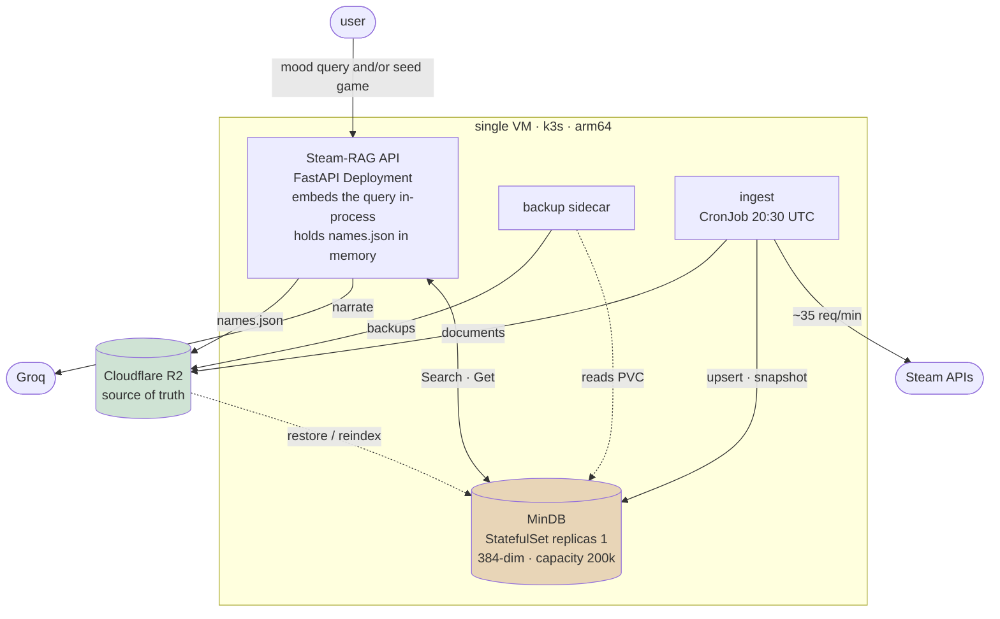

# GameRec

A RAG-based Steam game recommendation service. Describe what you feel like playing — or name a game you
liked — and it returns games from the corpus, with a short explanation of why each one fits.

The vector backend is [MinDB](https://github.com/DeviousDrops/mindb), an embedded exact-kNN store
written in Go: one flat in-memory slab of vectors with an id map, a free list for reuse, and whole-file
snapshots for durability. GameRec talks to it over FlatBuffers-on-gRPC. Everything runs on a single ARM
VM under k3s.

> ## The rule
>
> **MinDB holds no data that is not reproducible from R2.**
>
> MinDB is treated as a *derived index*: the source of truth is the Game Document Store in object
> storage, and recovery is the last backup generation plus an idempotent re-ingest. MinDB gained a
> write-ahead log in `v0.1.0`, and **the rule holds regardless.** A WAL improves MinDB's own crash
> durability; it does not make MinDB the source of truth, and it does not repeal this rule. If anything
> ever becomes MinDB-only, the rule is void and durability must be revisited before that change ships.
> See [ADR-0003](docs/adr/0003-mindb-is-a-derived-index.md).

## Architecture



The API embeds the query, asks MinDB for the nearest Game Documents, and optionally has Groq narrate the
result. Narration never gates a response — `?narrate=false` skips it entirely, which is also how the
latency benchmark measures retrieval rather than someone else's free tier.

Ingest writes Game Documents and the name index to R2 and upserts vectors into MinDB, then takes a
snapshot; the R2 edge also carries the **Ingest Lease**, a conditional `PutObject` that stops two runs
overlapping. The backup sidecar reads the snapshot off the PVC and publishes it to R2 as a numbered
backup generation.

**Seed games are resolved lexically, not semantically.** The API keeps a name index (`names.json`, built
by ingest and loaded into memory at startup) mapping every appid Steam knows about to its name and a
status: `in_corpus`, `filtered_low_reviews`, `not_a_game`, or `pending_ingest`. Matching is rapidfuzz at
a ≥90 score, and a raw appid bypasses fuzzy matching entirely. Because the index covers the whole
catalogue rather than just what was indexed, a seed that isn't available comes back with the exact
reason — "*Half-Life 3* hasn't been ingested yet" beats a bare "not found".
([ADR-0004](docs/adr/0004-name-resolution-is-lexical.md))

## Status

**Phase 2 — ingest hardening.** See [DECISIONS.md](DECISIONS.md) for the reasoning behind every
non-obvious choice, [CONTEXT.md](CONTEXT.md) for the vocabulary, and [docs/adr/](docs/adr/) for the
decisions that were hard to reverse.

| Phase | |
|---|---|
| 0 · Plan | done — MinDB API surface mapped, design settled |
| 1 · Local pipeline | done — ingest, search and narration working against the released MinDB image |
| 2 · Ingest hardening | done — resumable, idempotent, paced and bounded, with a model-stamp guard |
| 3 · Containerise + k8s | manifests on local k3d |
| 4 · CI + VM deploy | GitHub Actions, k3s bootstrap, backups |
| 5 · Polish | benchmarks, failure modes |

## Things worth knowing up front

- **The corpus is smaller than the catalogue.** Steam lists ~176,900 appids; that is the number *before*
  filtering. The corpus is everything with `type == "game"` above a configurable review floor (starting
  at 50), which drops demos, DLC, soundtracks, videos and the long tail of games nobody has reviewed —
  so the indexed count is materially lower. MinDB is provisioned at 200,000 vectors anyway, because its
  capacity is fixed at startup and growing it means a restart.
- **The corpus starts partial.** A full initial fill takes about three days at Steam's sustained rate of
  ~208 requests per 5 minutes, and metadata cannot be batched. The fill is resumable and ordered by
  popularity, so the most-wanted games are searchable within hours.
  ([ADR-0005](docs/adr/0005-initial-fill-is-resumable-and-the-corpus-starts-partial.md))
- **Single instance means visible downtime.** MinDB deploys with the `Recreate` strategy; the API
  returns `503` with `Retry-After` while it restarts.
- **Benchmarks are labelled by architecture, and the label is checked.** MinDB's int8 cascade has an
  AVX2 kernel that does not exist on ARM, so the deployed service is slower than any x86 figure for the
  same code. `/health` reports the kernel MinDB actually selected — `pure-go` on the ARM VM, `avx2` on
  an x86 dev box — so every published number can be tied to a kernel rather than an assumption.
  ([ADR-0006](docs/adr/0006-arm64-host-and-architecture-labelled-benchmarks.md))
- **MinDB is consumed, not vendored.** The dev stack and every deployment run
  `ghcr.io/deviousdrops/mindb:v0.1.0` — a released tag, never `latest`, built multi-arch for
  `linux/amd64` and `linux/arm64`, so the same tag runs on a dev laptop and on the Ampere VM. MinDB's
  own source, Dockerfile and CI live in its repo and are not modified from here. The FlatBuffers schema
  in `clients/` is pinned to the same tag (see [clients/README.md](clients/README.md)).

## Development

Requires Docker and Python 3.13. Configuration is environment variables; secrets never live in the repo.

```bash
docker compose up                 # MinDB + API locally
python -m ingest.run --limit 200  # fetch, embed and upsert a popularity-ordered slice
python -m ingest.reindex          # rebuild every vector from documents.jsonl, no Steam requests
pytest -q                         # unit tests; the codec test needs MinDB up
```

`ingest.run` is safe to interrupt and safe to rerun. It resumes from `data/checkpoint.json`, paces
itself against Steam, and takes new appids before refreshes, so a stop halfway never costs the games
it had not reached yet. It refuses to run at all if the checkpoint was written by a different
embedding model — `ingest.reindex --compact` is the way out of that, and it rebuilds from the
documents already on disk rather than re-fetching from Steam.

## Licence

[MIT](LICENSE).
